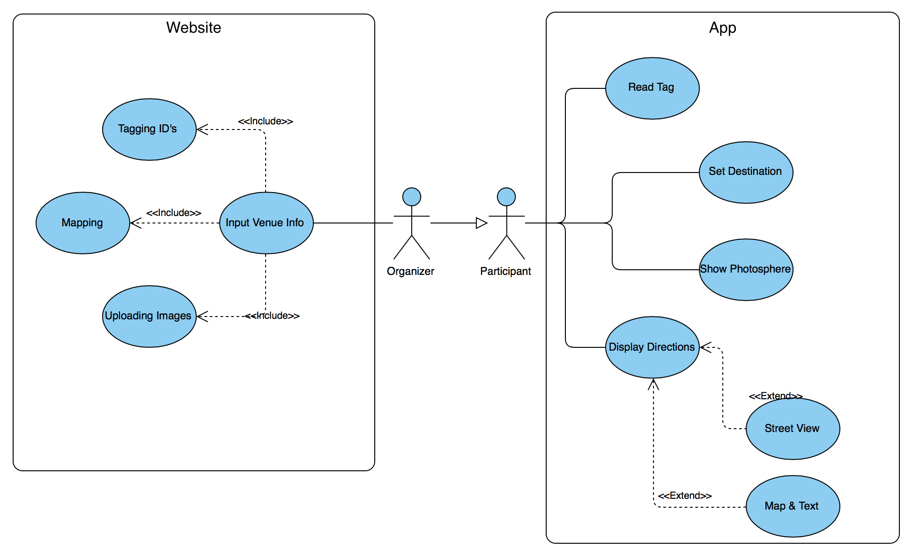
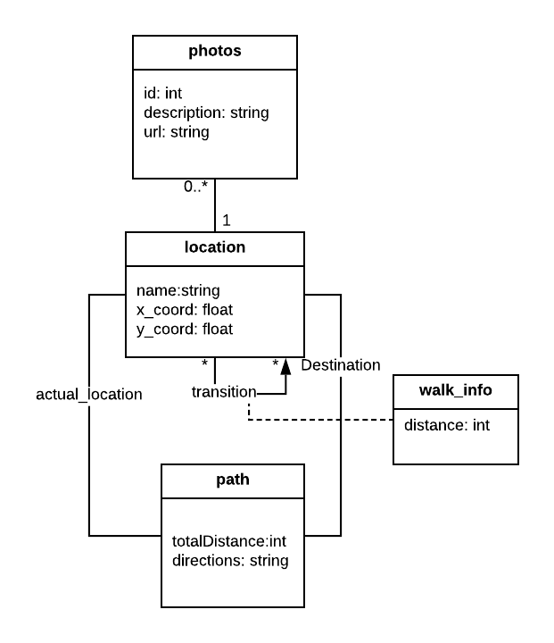
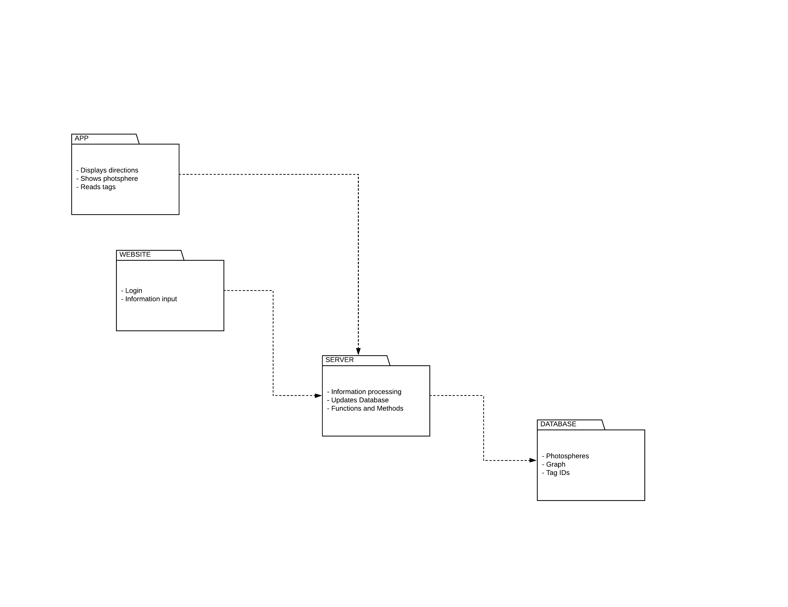

# openCX - ConfView

Welcome to the documentation pages of the *ConfView* of **openCX**!

You can find here detailed about the (sub)product, hereby mentioned as module, from a high-level vision to low-level implementation decisions, a kind of Software Development Report (see [template](https://github.com/softeng-feup/open-cx/blob/master/docs/templates/Development-Report.md)), organized by discipline (as of RUP):

* Business modeling 
  * [Product Vision](#Product-Vision)
  * [Elevator Pitch](#Elevator-Pitch)
* Requirements
  * [Use Case Diagram](#Use-case-diagram)
  * [User stories](#User-stories)
  * [Domain model](#Domain-model)
* Architecture and Design
  * [Logical architecture](#Logical-architecture)
  * [Physical architecture](#Physical-architecture)
  * [Prototype](#Prototype)
* [Implementation](#Implementation)
* [Test](#Test)
* [Configuration and change management](#Configuration-and-change-management)
* [Project management](#Project-management)

So far, contributions are exclusively made by the initial team, but we hope to open them to the community, in all areas and topics: requirements, technologies, development, experimentation, testing, etc.

Please contact us! 

Thank you!

* **António Dantas**
* **Bernardo Santos**
* **Gustavo Torres**
* **Vítor Gonçalves**

## Business Modeling
### Product Vision
* **Vision** : Find where you are and how to go everywhere on the conference.

* **Description**: A image on spot view of diferent places on the conference, through panoramic view of just photos of conference's places, so that people can have a better orientation of where they are and time-lapse like movement or video that will indicate the shortest path to the place where you want to go from where you are. Given that you might not know where you are, there will be NFC tags or Bluethooth devices spread on the conference that will locate you automatically on the app.

* **Requisits**: NFC tags for location and database to hold images, locations and paths of the conference.
### Elevator Pitch
* When you go to a conference, you go there with which purpose? With the purpose of getting the best and the most of the conference, from the moment we step in. However, from the moment we arrive, we find ourselves in that new space we don’t know and we don’t even know how to go to where we want or need, losing those precious moment of the beginning of a lecture or workshop. For that, the ideal would be an application that would allow us to locate ourselves automatically, anywhere, on any conference, fast and effectively, with the help of a 3D view and a visualization of the path to where we want to go, minimizing the time and effort we need to locate ourselves and to know how to get where we want.

## Requirements
### Use case diagram

In the use-case diagram above we can see two main possibilities of usage of our product: Setting up a ConfView environment for your conference or using the App's capabilities to guide you during a conference.

__Setting up a ConfView environment:__
* **Actor**: The actor taking part in this case will be a conference organizer. It should give information about the venue that will be processed afterwards and used in the App.

* **Description**: By letting organizers input their venue info to a website that is linked to our app database we allow our product to be used in various conferences.

* **Preconditions and Postconditions**: In order for this to work it is needed, for the actor taking part, to map the venue with some NFC tags and have a basic knowledge of how coordinates work on a graph of their conference location.

* **Normal Flow**: Under the expected conditions the organizer should fill in a _form_ on the website telling how many nodes his conference map has, giving _x_ and _y_ coordinates to each node and checking wether that node has a tag placed or not. All this information is then processed and stored in a database that can be accessed and used in a human-friendly way on the ConfView App.

* **Alternative Flows and Exceptions**: A usage scenario where this use case can be troubling is if the organizer inputs information about the venue incorrectly. This would result on a broken guidance couseling for the conference in question, showing the map incorrectly and misplacing tags.

__Guidance App:__
* **Actor**: The actor taking part in this case will be the regular conference attendee. However, nothing stops the event organizers or speakers to download the App as well, it is free to use.

* **Description**: Attendees can use the App to get a clear understanding of the venue's location and find out the shortest path from where they are to where they are headed. It can display photospheres, directions and even read NFC tags to show exactly where they are in the map. 

* **Preconditions and Postconditions**: In order for this to work all the user needs is a smartphone and internet connection to download the App. We aren't quite sure wether internet connection will be needed when using the App but we are working on trying to make that not necessary.

* **Normal Flow**: We can look at the ConfView experience from the prespective of someone that is going to attend a conference and hasn't done any research whatsoever about the location of it. He just knows what lectures he wants to attend. All he needs to do is type in the name of the lecture's auditorium and the app will calculate the shortest path to it. It can also display 3D images of certain key locations of the venue and a map telling, in real-time, where exactly we are in the venue. Dining areas and bathrooms are also stored in the database so attendees can look that up too.

* **Alternative Flows and Exceptions**: Although we are trying our best to make this as intuitive and easy to use as possible there are always cases where the algorythms used don't work, especially if the information about the venue is not correctly set up. Some smartphones can also have problems reading the NFC tags which would result in an incomplete ConfView experience.

### User stories
* **Trello** : [Also contains Acceptance Test & Mockups](https://trello.com/b/m0GrAXGv/user-stories-esof) 
### Domain model

To better understand the context of the software system, it is very useful to have a simple UML class diagram with key concepts and relationships involved of the problem domain addressed by our module.
The diagram shows all locations have an associated image, we can do many transitions between locations, each one with some info. A path is an association between two locations, our atual location and the destination.
## Architecture and Design

### Logical Architecture

The UML diagram above represents the logical architecture of our code divided essentially in 2 big parts, an App and a Website. Both connect to a server where all information loaded at the website will be processed and then saved into a database. In the opposite way, an app will display the correct information a user needs, depending on our database.

### Physical Architecture

The deployment UML diagram above documents high-level physical structures of the software system. The Nodes represent hardware requirements for the project's idea to work properly. Each one holds one or more components, this is, pieces of software that vary in language or functionality and can communicate with each other.

### Prototype
