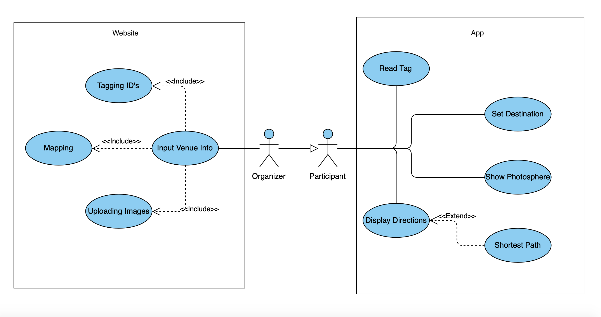
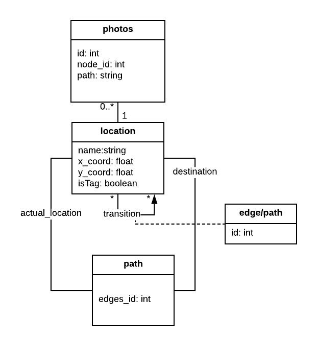
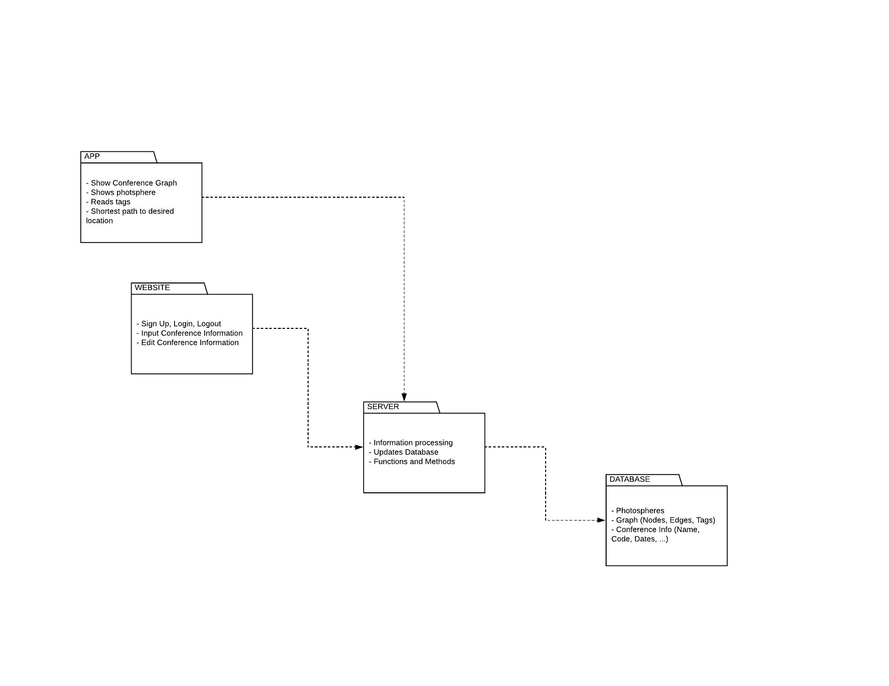
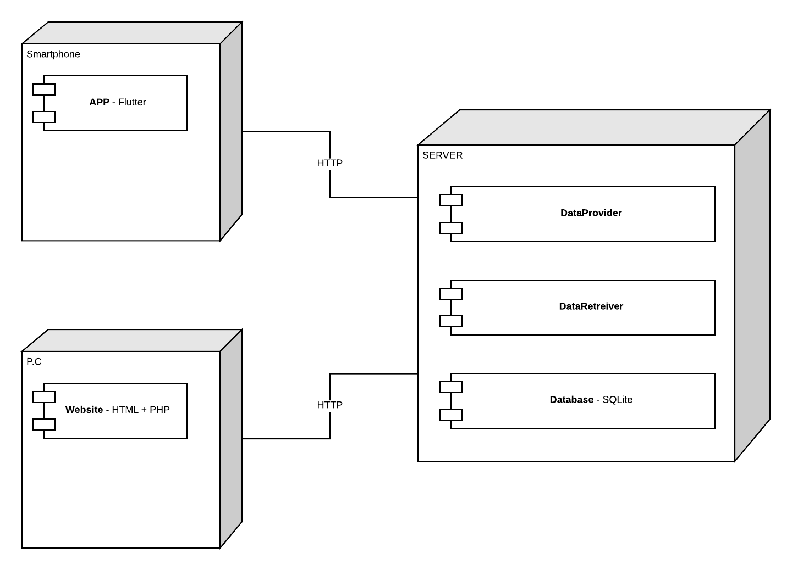

# openCX - ConfView

Welcome to the documentation pages of the *ConfView* of **openCX**!

You can find here detailed about the (sub)product, hereby mentioned as module, from a high-level vision to low-level implementation decisions, a kind of Software Development Report (see [template](https://github.com/softeng-feup/open-cx/blob/master/docs/templates/Development-Report.md)), organized by discipline (as of RUP):

* Business modeling 
  * [Product Vision](#Product-Vision)
  * [Elevator Pitch](#Elevator-Pitch)
* Requirements
  * [Use Case Diagram](#Use-case-diagram)
  * [User stories](#User-stories)
  * [Domain model](#Domain-model)
* Architecture and Design
  * [Logical architecture](#Logical-architecture)
  * [Physical architecture](#Physical-architecture)
  * [Prototype](#Prototype)
* [Implementation](#Implementation)
* [Test](#Test)
* [Configuration and change management](#Configuration-and-change-management)
* [Project management](#Project-management)
* [Mockups](#Mockups)
* [Acceptance Tests](#Acceptance-tests)

* [Evolution - contributions to open-cx](#Contributions-to-Open-cx)

So far, contributions are exclusively made by the initial team, but we hope to open them to the community, in all areas and topics: requirements, technologies, development, experimentation, testing, etc.

Please contact us! 

Thank you!

* **António Dantas**
* **Bernardo Santos**
* **Gustavo Torres**
* **Vítor Gonçalves**

## Business Modeling
### Product Vision
* **Vision** : Find where you are and how to go everywhere on the conference.

* **Description**: A image on spot view of diferent places on the conference, through panoramic view of just photos of conference's places, so that people can have a better orientation of where they are and time-lapse like movement or video that will indicate the shortest path to the place where you want to go from where you are. Given that you might not know where you are, there will be NFC tags or Bluethooth devices spread on the conference that will locate you automatically on the app.

* **Requisits**: NFC tags for location and database to hold images, locations and paths of the conference.
### Elevator Pitch
* When you go to a conference, you go there with which purpose? With the purpose of getting the best and the most of the conference, from the moment we step in. However, from the moment we arrive, we find ourselves in that new space we don’t know and we don’t even know how to go to where we want or need, losing those precious moment of the beginning of a lecture or workshop. For that, the ideal would be an application that would allow us to locate ourselves automatically, anywhere, on any conference, fast and effectively, with the help of a 3D view and a visualization of the path to where we want to go, minimizing the time and effort we need to locate ourselves and to know how to get where we want.

## Requirements
### Use case diagram

In the use-case diagram above we can see two main possibilities of usage of our product: Setting up a ConfView environment for your conference or using the App's capabilities to guide you during a conference.

* **Organizer**: The Organizer is the person or the group of people that are in charge of arranging the conference. They have permission and the information needed to map the venue using our website. 

* **Participant**: The Participant represents everybody that attends the conference and uses our App.

__Setting up a ConfView environment:__

* **Input Venue Info**
  - **Actor**: The actor taking part in this case will be a conference organizer. It should give information about the venue that will be processed afterwards and used in the App.

  - **Description**: By letting organizers input their venue info to a website that is linked to our app database we allow our product to be used in various conferences.

  - **Preconditions**: In order for this to work it is needed, for the actor taking part, to map the venue with some NFC tags and have a basic knowledge of how coordinates work on a graph of their conference location.

  - **Normal Flow**: Under the expected conditions the organizer should fill in a _form_ on the website telling how many nodes his conference map has, giving _x_ and _y_ coordinates to each node and checking wether that node has a tag placed or not. 

  - **Postconditions**: All that information is then processed and stored in a database that can be accessed and used in a human-friendly way on the ConfView App.

  - **Alternative Flows and Exceptions**: A usage scenario where this use case can be troubling is if the organizer inputs information about the venue incorrectly. This would result on a broken guidance couseling for the conference in question, showing the map incorrectly and misplacing tags.

__Guidance App:__

* **Read Tag**
  - **Actor**: The actor taking part in this case will be the regular conference attendee. However, nothing stops the event organizers or speakers to download the App as well, it is free to use.

  - **Description**: Attendees can use the App to read NFC tags that will automatically show a Photosphere of the spot they're in.

  - **Preconditions**: In order for this to work all the user needs is a smartphone and internet connection to use the App.

  - **Normal Flow**: The user simply needs to get their phone close enough of the NFC tag whilst the App is running and wait for the image to be loaded.
 
  - **Postconditions**: The image of the spot the user's are is loaded and they can see a Photosphere of it. The Photosphere marks the direction of other spots.
 

  - **Alternative Flows and Exceptions**: Some smartphones can have problems reading the NFC tags which would result in an incomplete ConfView experience.
 
 
* **Display Directions**

  - **Actor**: The actor taking part in this case will be the regular conference attendee. However, nothing stops the event organizers or speakers to download the App as well, it is free to use.

  - **Description**: Attendees can use the App to get a clear understanding of the venue's location and find out the shortest path from where they are to where they are headed.

  - **Preconditions**: In order for this to work all the user needs is a smartphone and internet connection to use the App.

  - **Normal Flow**: We can look at the ConfView experience from the prespective of someone that is going to attend a conference and hasn't done any research whatsoever about the location of it. He just knows what lectures he wants to attend. All he needs to do is type in the name of the room or auditorium he wants to go, bathrooms and dining areas will also be in the conference database so they can look that up too.
 
  - **Postconditions**: Then, the app will calculate the shortest path to that place and tell the user where he needs to go.

  - **Alternative Flows and Exceptions**: Although we are trying our best to make this as intuitive and easy to use as possible there are always cases where the algorythms used don't work, especially if the information about the venue is not correctly set up.
 

### User stories
* **Trello** : [Also contains Acceptance Test & Mockups](https://trello.com/b/m0GrAXGv/user-stories-esof) 
### Domain model

To better understand the context of the software system, it is very useful to have a simple UML class diagram with key concepts and relationships involved of the problem domain addressed by our module.
The diagram shows all locations have an associated image, we can do many transitions between locations, each one with some info. A path is an association between two locations, our atual location and the destination.
## Architecture and Design

### Logical Architecture

The UML diagram above represents the logical architecture of our code divided essentially in 2 big parts, an App and a Website. Both connect to a server where all information loaded at the website will be processed and then saved into a database. In the opposite way, an app will display the correct information a user needs, depending on our database.

### Physical Architecture

The deployment UML diagram above documents high-level physical structures of the software system. The Nodes represent hardware requirements for the project's idea to work properly. Each one holds one or more components, this is, pieces of software that vary in language or functionality and can communicate with each other.

### Prototype

At the end the o iteration 0, none of the user stories were fully implemented. Our main goal was to discuss between React Native or Flutter as a framework. We researched the differences, advantages and disadvantages of each one and we thought the best option would be Flutter. We also opted for Flutter since most groups are working with this framework and therefore it would be easier to exchange ideas and solve problems between groups.

At this iteration, Logical and Physical architecture diagram, Domain Model and Use Case Diagram were done, as all the Business Modeling. 

Last but not least, user stories have been refactored since some of them weren't testable or were to long.

## Implementation
### Iteration 1: 

Started using Flutter aplication to show Photospheres and Panoramic Photos.

Started to think about our own database to keep our data to be accessed by the App.

### Iteration 2: 

At flutter application it is now possible to add a new Conference, delete it and show all the conferences.

Finished database and started website creation and connection of the site with database. 

### Iteration 3: 
It is Now possible to read a NFC tag at our application. We started working on graphs to show the conferences map.

Website is ready to create a conference and save data into our database.

### Iteration 4: 

ConfView application shows a graph with images associated to nodes, and if we search for a location in the search bar, our app shows the shortest path between the current location to the desired location by highlighting a part of the screen.

Organizers can edit previous created conferences.
Our website contains a login and signup feature, so conferences can only be viewed and edited by their organizer.

### Iteration 5: 

The application is able to display the graphs stored in the database.

## Test

### Test Plan:

To understand if we have a viable product we need a way to validate the features we are selling. Our product deals with navigation on a conference and the ability for conference organizers to map their own venue, with very little costs, so with unit testing this becomes very difficult. However, acceptance testing using **Gherkin** is very useful to prove we have found solutions to the problems specified on our **User Stories**. You can find these tests on our [Trello](https://trello.com/b/m0GrAXGv/user-stories-esof) board.

On the other hand, some tests can be deducted easily. 
* When a new conference is added to the **website** its information should accessible on the **App**. We are talking about the nodes that mark each point in the graph, its edges, and the Photosphere's display when a user read an **NFC** tag.
* When opening the **App** and looking for the conference the user's attending, the map and further information should only be accessible if they enter the correct conference code.
* When reading an **NFC** tag the corresponding Photosphere should be displayed and capable of being "dragged" for complete 360º experience.
* On the **website** if an organizer wants to create a new conference map or edit an existing one he should firstly input its credentials (username and password) to ensure that only he is allowed to make changes.

## Configuration and change management
As requested and suggested throughout the course, we have adopted the use of Github flow features:
* **branches:** We have created new branches to the development of new features and bug fixes. Each one with a proper name.
* **discussion & review:** To verify that everything is as intended.
* **merge:** Merge to master after review.

## Project management
Our team adopted as Project management tool Trello, since it was suggested to us by the teacher and it seemed easy to understand and quite intuitive. Also, Trello's capable of registering tasks, assign tasks to people, add estimations to tasks, monitor tasks progress.

You can visit our trello [here](https://trello.com/b/m0GrAXGv/user-stories-esof).

## Mockups

Can be seen in our board, associated with respective user story.
* **Trello** : [View](https://trello.com/b/m0GrAXGv/user-stories-esof) 

## Acceptance Tests

Can be seen in our board, associated with respective user story.
* **Trello** : [View](https://trello.com/b/m0GrAXGv/user-stories-esof) 

## Contributions to Open cx

Working ...
