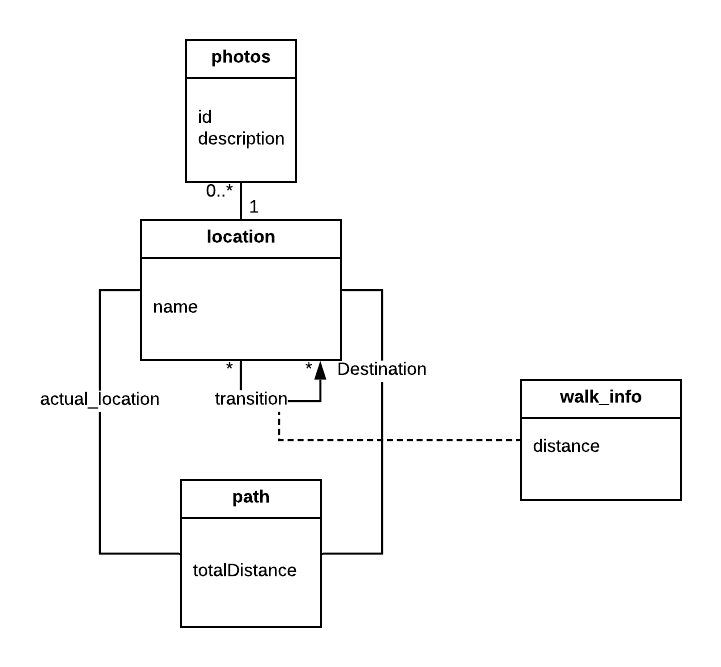

# openCX - ConfView

Welcome to the documentation pages of the *ConfView* of **openCX**!

You can find here detailed about the (sub)product, hereby mentioned as module, from a high-level vision to low-level implementation decisions, a kind of Software Development Report (see [template](https://github.com/softeng-feup/open-cx/blob/master/docs/templates/Development-Report.md)), organized by discipline (as of RUP):

* Business modeling 
  * [Product Vision](#Product-Vision)
  * [Elevator Pitch](#Elevator-Pitch)
* Requirements
  * [Use Case Diagram](#Use-case-diagram)
  * [User stories](#User-stories)
  * [Domain model](#Domain-model)
* Architecture and Design
  * [Logical architecture](#Logical-architecture)
  * [Physical architecture](#Physical-architecture)
  * [Prototype](#Prototype)
* [Implementation](#Implementation)
* [Test](#Test)
* [Configuration and change management](#Configuration-and-change-management)
* [Project management](#Project-management)

So far, contributions are exclusively made by the initial team, but we hope to open them to the community, in all areas and topics: requirements, technologies, development, experimentation, testing, etc.

Please contact us! 

Thank you!

* **António Dantas**
* **Bernardo Santos**
* **Gustavo Torres**
* **Vítor Gonçalves**

## Business Modeling
### Product Vision
* **Vision** : Find where you are and how to go everywhere on the conference.

* **Description**: A image on spot view of diferent places on the conference, through panoramic view of just photos of conference's places, so that people can have a better orientation of where they are and time-lapse like movement or video that will indicate the shortest path to the place where you want to go from where you are. Given that you might not know where you are, there will be NFC tags or Bluethooth devices spread on the conference that will locate you automatically on the app.

* **Requisits**: NFC tags for location and database to hold images, locations and paths of the conference.
### Elevator Pitch
* When you go to a conference, you go there with which purpose? With the purpose of getting the best and the most of the conference, from the moment we step in. However, from the moment we arrive, we find ourselves in that new space we don’t know and we don’t even know how to go to where we want or need, losing those precious moment of the beginning of a lecture or workshop. For that, the ideal would be an application that would allow us to locate ourselves automatically, anywhere, on any conference, fast and effectively, with the help of a 3D view and a visualization of the path to where we want to go, minimizing the time and effort we need to locate ourselves and to know how to get where we want.

## Requirements
### Use case diagram

### User stories
* **Trello** : [English](https://trello.com/b/m0GrAXGv/user-stories-esof)
### Domain model

To better understand the context of the software system, it is very useful to have a simple UML class diagram with key concepts and relationships involved of the problem domain addressed by our module.
The diagram shows all locations have an associated image, we can do many transitions between locations, each one with some info. A path is an association between two locations, our atual location and the destination.
## Architecture and Design

### Logical Architecture

The UML diagram above represents the logical architecture of our code divided essentially in 2 big parts, an App and a Website. Both connect to a server where all information loaded at the website will be processed and then saved into a database. In the opposite way, an app will display the correct information a user needs, depending on our database.

### Physical Architecture

The deployment UML diagram above documents high-level physical structures of the software system. The Nodes represent hardware requirements for the project's idea to work properly. Each one holds one or more components, this is, pieces of software that vary in language or functionality and can communicate with each other.

### Prototype
